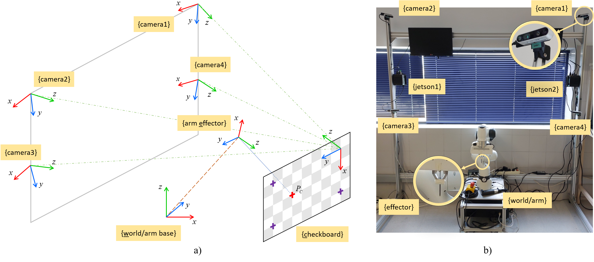

# pHRI-Vision-Robot-Workstation
Design of a workstation with visual and tactile sensing for physical human-robot interaction




## Installation

Clone the repository by executing:

```
git clone https://github.com/TaISLab/pHRI-Vision-Robot-Workstation.git
```

Build the keypoints3d_ws workspace:

```
cd /path/to/pHRI-Vision-Robot-Workstation/keypoints3d_ws/
catkin_make
catkin_make install
```

## Bag files

Download the bag files from the Kaggle dataset and extract them:

https://www.kaggle.com/datasets/jesusgomezdegabriel/human-upper-limb-joints-with-vision-only-for-phri/data


## Visualize the data on RViz

Source the workspace and execute a terminal:

```
source /path/to/pHRI-Vision-Robot-Workstation/keypoints3d_ws/install/setup.bash
roslaunch keypoints_3d keypoint_skeleton.launch use_rviz:=true
```

Play the rosbag file on another terminal:

```
cd /path_to_bag_files/
rosbag play <exercise_file.bag>
```

